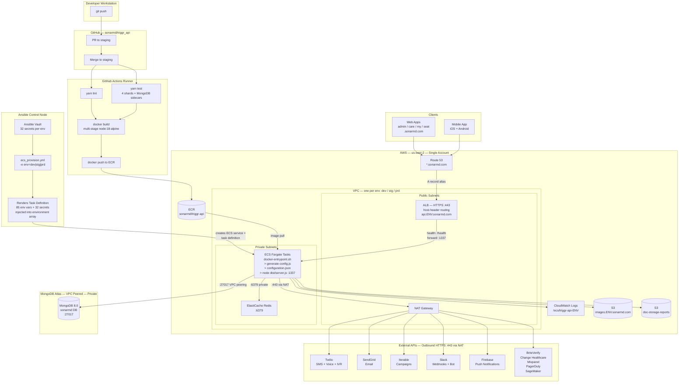
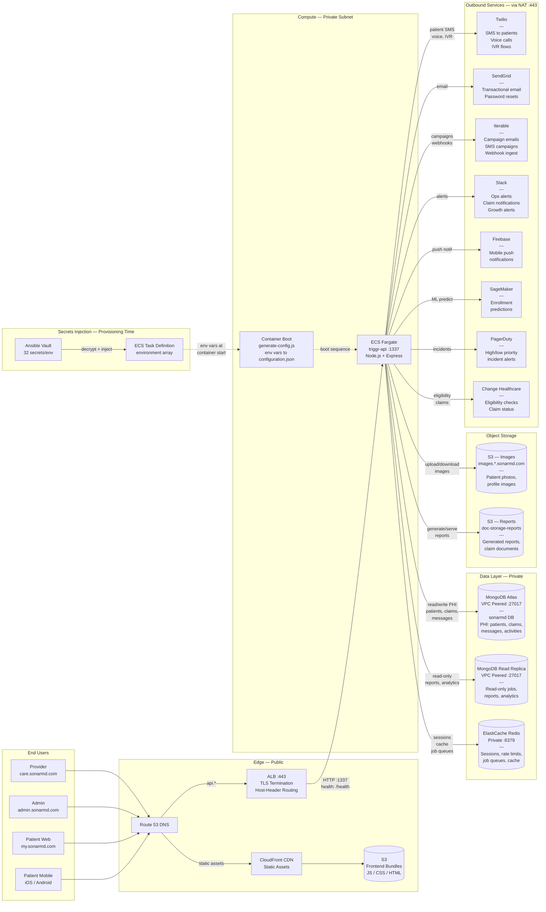

# System Diagrams — SonarMD ECS Architecture

## System Architecture + CI/CD Pipeline

```mermaid
flowchart TD
    subgraph DEV["Developer Workstation"]
        code["git push"]
    end

    subgraph GITHUB["GitHub — sonarmd/triggr_api"]
        pr["PR to staging"]
        merge["Merge to staging"]
    end

    subgraph CI["GitHub Actions Runner"]
        lint["yarn lint"]
        test["yarn test\n4 shards + MongoDB sidecars"]
        docker_build["docker build\nmulti-stage node:18-alpine"]
        docker_push["docker push to ECR"]
    end

    subgraph CONTROL["Ansible Control Node"]
        vault["Ansible Vault\n32 secrets per env"]
        playbook["ecs_provision.yml\n-e env=dev|stg|prd"]
        taskdef["Renders Task Definition\n85 env vars + 32 secrets\ninjected into environment array"]
    end

    subgraph AWS["AWS — us-east-2 — Single Account"]
        ecr[("ECR\nsonarmd/triggr-api")]
        cw["CloudWatch Logs\n/ecs/triggr-api-ENV"]
        s3_img[("S3\nimages.ENV.sonarmd.com")]
        s3_rpt[("S3\ndoc-storage-reports")]
        r53["Route 53\n*.sonarmd.com"]

        subgraph VPC_DETAIL["VPC — one per env: dev / stg / prd"]
            subgraph PUB["Public Subnets"]
                alb["ALB — HTTPS :443\nhost-header routing\napi.ENV.sonarmd.com"]
                nat["NAT Gateway"]
            end
            subgraph PRIV["Private Subnets"]
                fargate["ECS Fargate Tasks\ndocker-entrypoint.sh\n> generate-config.js\n> configuration.json\n> node dist/server.js :1337"]
                redis["ElastiCache Redis\n:6379"]
            end
        end
    end

    subgraph ATLAS["MongoDB Atlas — VPC Peered — Private"]
        mongo[("MongoDB 8.0\nsonarmd DB\n:27017")]
    end

    subgraph EXTERNAL["External APIs — Outbound HTTPS :443 via NAT"]
        twilio["Twilio\nSMS + Voice + IVR"]
        sendgrid["SendGrid\nEmail"]
        iterable["Iterable\nCampaigns"]
        slack["Slack\nWebhooks + Bot"]
        firebase["Firebase\nPush Notifications"]
        others["BriteVerify\nChange Healthcare\nMixpanel\nPagerDuty\nSageMaker"]
    end

    subgraph CLIENTS["Clients"]
        web["Web Apps\nadmin / care / my / seat\n.sonarmd.com"]
        mobile["Mobile App\niOS + Android"]
    end

    code --> pr --> merge
    merge --> lint & test
    lint & test --> docker_build --> docker_push --> ecr

    vault --> playbook --> taskdef
    taskdef -- "creates ECS service +\ntask definition" --> fargate

    ecr -- "image pull" --> fargate
    fargate --> cw
    fargate --> s3_img & s3_rpt
    fargate -- ":27017 VPC peering" --> mongo
    fargate -- ":6379 private" --> redis
    fargate -- ":443 via NAT" --> nat
    nat --> twilio & sendgrid & iterable & slack & firebase & others

    web & mobile --> r53
    r53 -- "A record alias" --> alb
    alb -- "health: /health\nforward :1337" --> fargate
```

## Data Flow Diagram

```mermaid
flowchart LR
    subgraph USERS["End Users"]
        provider["Provider\ncare.sonarmd.com"]
        admin["Admin\nadmin.sonarmd.com"]
        patient_web["Patient Web\nmy.sonarmd.com"]
        patient_app["Patient Mobile\niOS / Android"]
    end

    subgraph EDGE["Edge — Public"]
        cf["CloudFront CDN\nStatic Assets"]
        s3_fe[("S3\nFrontend Bundles\nJS / CSS / HTML")]
        r53["Route 53 DNS"]
        alb["ALB :443\nTLS Termination\nHost-Header Routing"]
    end

    subgraph COMPUTE["Compute — Private Subnet"]
        ecs["ECS Fargate\ntriggr-api :1337\nNode.js + Express"]
        entrypoint["Container Boot\ngenerate-config.js\nenv vars to configuration.json"]
    end

    subgraph DATA["Data Layer — Private"]
        mongo[("MongoDB Atlas\nVPC Peered :27017\n---\nsonarmd DB\nPHI: patients, claims,\nmessages, activities")]
        mongo_ro[("MongoDB Read Replica\nVPC Peered :27017\n---\nRead-only jobs,\nreports, analytics")]
        redis[("ElastiCache Redis\nPrivate :6379\n---\nSessions, rate limits,\njob queues, cache")]
    end

    subgraph STORAGE["Object Storage"]
        s3_img[("S3 — Images\nimages.*.sonarmd.com\n---\nPatient photos,\nprofile images")]
        s3_rpt[("S3 — Reports\ndoc-storage-reports\n---\nGenerated reports,\nclaim documents")]
    end

    subgraph OUTBOUND["Outbound Services — via NAT :443"]
        twilio["Twilio\n---\nSMS to patients\nVoice calls\nIVR flows"]
        sendgrid["SendGrid\n---\nTransactional email\nPassword resets"]
        iterable["Iterable\n---\nCampaign emails\nSMS campaigns\nWebhook ingest"]
        slack["Slack\n---\nOps alerts\nClaim notifications\nGrowth alerts"]
        firebase["Firebase\n---\nMobile push\nnotifications"]
        sagemaker["SageMaker\n---\nEnrollment\npredictions"]
        pagerduty["PagerDuty\n---\nHigh/low priority\nincident alerts"]
        change_hc["Change Healthcare\n---\nEligibility checks\nClaim status"]
    end

    subgraph SECRETS["Secrets Injection — Provisioning Time"]
        vault["Ansible Vault\n32 secrets/env"]
        taskdef["ECS Task Definition\nenvironment array"]
    end

    provider & admin & patient_web --> r53
    patient_app --> r53
    r53 -- "static assets" --> cf --> s3_fe
    r53 -- "api.*" --> alb
    alb -- "HTTP :1337\nhealth: /health" --> ecs

    entrypoint -. "boot sequence" .-> ecs

    ecs -- "read/write PHI\npatients, claims,\nmessages" --> mongo
    ecs -- "read-only\nreports, analytics" --> mongo_ro
    ecs -- "sessions\ncache\njob queues" --> redis

    ecs -- "upload/download\nimages" --> s3_img
    ecs -- "generate/serve\nreports" --> s3_rpt

    ecs -- "patient SMS\nvoice, IVR" --> twilio
    ecs -- "email" --> sendgrid
    ecs -- "campaigns\nwebhooks" --> iterable
    ecs -- "alerts" --> slack
    ecs -- "push notif" --> firebase
    ecs -- "ML predict" --> sagemaker
    ecs -- "incidents" --> pagerduty
    ecs -- "eligibility\nclaims" --> change_hc

    vault -- "decrypt + inject" --> taskdef
    taskdef -. "env vars at\ncontainer start" .-> entrypoint
```
