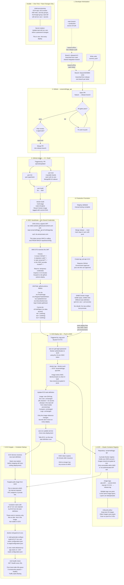

# CI/CD Pipeline — triggr_api

How code gets from a developer's laptop into a running container in AWS.

```mermaid
flowchart TD
    subgraph DEVELOPER["1. Developer Workstation"]
        main["main branch\n= production\nsource of truth"]
        release["Branch: release/v4.5\nbranched from main\nshared integration branch"]
        feature["Branch: feature/SONMD-1234\nbranched from release\none branch per ticket"]
        work["Write code\ncommit, push"]

        main -. "branch off for\nnew release cycle" .-> release
        release -. "branch off for\neach ticket" .-> feature
        work --> feature
    end

    subgraph GITHUB["2. GitHub — sonarmd/triggr_api"]
        pr["Open PR\nfeature → release branch"]
        checks{"All gates pass?"}
        review{"Peer review\n2 approvals?"}
        merge["Merge PR\ninto release branch"]

        pr --> checks
        checks -- "fail" --> fix["Fix and re-push"]
        fix --> checks
        checks -- "pass" --> review
        review -- "approved" --> merge
    end

    subgraph GHA["3. GitHub Actions — CI + Build"]
        direction TB
        ci_trigger["Triggered by: PR opened/updated"]
        lint["yarn lint\nyarn typecheck"]
        test["yarn test\n4 parallel shards\neach with its own\nMongoDB 8.0 sidecar"]
        build["yarn build\ntsc → dist/"]
        docker["docker build\nmulti-stage\nnode:18-alpine\nResult: Docker image\ntagged with commit SHA"]

        ci_trigger --> lint & test
        lint & test --> build --> docker
    end

    subgraph OIDC["4. OIDC Handshake — No Stored Credentials"]
        direction TB
        jwt["GHA mints a signed JWT:\niss: token.actions.githubusercontent.com\nsub: repo:sonarmd/triggr_api:ref:refs/tags/stg-*\naud: sts.amazonaws.com\n\nThis token proves WHO is calling\nand FROM WHICH repo/branch/tag"]
        sts["AWS STS receives the JWT\n\nChecks:\n  Is issuer GitHub? ✓\n  Is signature valid? ✓\n  Is repo sonarmd/*? ✓\n  Is the OIDC provider trusted? ✓\n\nReturns: temporary credentials\nExpires in 15 minutes\nScoped to role github-actions-deploy"]
        role["IAM Role: github-actions-deploy\n\nCan do:\n  ecr:PushImage\n  ecs:RegisterTaskDefinition\n  ecs:UpdateService\n  ecs:DescribeServices\n  logs:CreateLogStream\n\nCannot do:\n  s3:GetObject (no data access)\n  rds:* (nothing)\n  iam:* (nothing)\n  ec2:* (nothing)"]

        jwt --> sts --> role
    end

    subgraph DEPLOY["5. GHA Deploy Job — Push to AWS"]
        direction TB
        deploy_trigger["Triggered by: tag push\nstg-api-4.5.0-b1"]
        ecr_login["aws ecr get-login-password\nDocker authenticates to ECR\nusing the 15-min OIDC token"]
        ecr_push["docker tag + docker push\n→ ECR: sonarmd/triggr-api:SHA\n\nImage enters AWS.\nIdentical bytes to what CI built.\nNow stored encrypted in ECR."]
        taskdef["Update ECS task definition\n\nImage: new SHA tag\nEnv vars: unchanged\n  (85 cleartext + 32 secrets\n   already in the task def\n   from initial Ansible provisioning)\nCompute: unchanged\nLogs: unchanged\n\nOnly the image reference changes.\nSecrets don't move on every deploy."]
        update_svc["aws ecs update-service\n  --force-new-deployment\n\nTells ECS: run the new\ntask definition now"]
        token_expires["OIDC token expires\n15 minutes after issuance\n\nGHA no longer has\nany access to AWS"]

        deploy_trigger --> ecr_login --> ecr_push --> taskdef --> update_svc --> token_expires
    end

    subgraph ECR_DETAIL["6. ECR — Elastic Container Registry"]
        direction TB
        ecr_repo["Repository: sonarmd/triggr-api\n\nA private Docker registry\ninside your AWS account.\nImages stored encrypted at rest.\nOnly accessible within AWS\nor via authenticated API call."]
        ecr_tags["Image tags:\n  :abc123f  ← commit SHA\n  :stg-api-4.5.0-b1  ← release tag\n\nMultiple tags can point\nto the same image layers.\nLayers are deduplicated."]
        ecr_lifecycle["Lifecycle policy:\nKeep last 20 images\nOlder images auto-expire\nScan on push for CVEs"]

        ecr_repo --- ecr_tags --- ecr_lifecycle
    end

    subgraph ECS_BOOT["7. ECS Fargate — Container Startup"]
        direction TB
        ecs_svc["ECS Service receives\nnew task definition\n\nStarts new task(s)\nbefore stopping old ones\n(rolling deployment)"]
        ecs_pull["Fargate pulls image from ECR\n\nThis is internal to AWS.\nNo internet required.\nVPC endpoint or private link."]
        ecs_env["Container starts with\nall 117 env vars injected\nby ECS from the task definition\n\nThese exist in memory only.\nNot on disk. Not in the image.\nNot visible in ECR."]
        entrypoint["docker-entrypoint.sh runs:\n\n1. node generate-config.js\n   reads all 117 env vars\n   writes configuration.json\n   to /app/configuration.json\n\n2. exec node dist/server.js\n   app starts on :1337\n   reads configuration.json"]
        health["ALB health check\nGET /health every 30s\n\nFirst check after 60s grace\n3 consecutive passes = healthy\nTraffic starts flowing"]

        ecs_svc --> ecs_pull --> ecs_env --> entrypoint --> health
    end

    subgraph PROD["8. Production Promotion"]
        stg_valid["Staging validated\nmanual testing complete"]
        merge_main["Merge release → main\nmain stays in sync with prod"]
        tag_prd["Create tag: prd-api-4.5.0\n\nRequires GitHub\nEnvironment approval\n(you set who can approve)"]
        same_image["SAME Docker image\nSAME bytes, SAME SHA\nDifferent task definition\n  (prd env vars + prd secrets)\n\nNo rebuild. No new artifact.\nJust promote."]

        stg_valid --> merge_main --> tag_prd --> same_image
    end

    subgraph ANSIBLE_ROLE["Ansible — One-Time + Rare Changes Only"]
        direction TB
        provision["Initial provisioning:\nECR repo, ECS cluster,\nIAM roles, security groups,\nALB target group, task def\nwith all env vars + secrets"]
        secret_update["Secret rotation:\nUpdate task def env vars\nwhen a password changes\n\nThis is rare. Not every deploy."]

        provision --- secret_update
    end

    feature --> pr
    merge --> ci_trigger
    docker --> jwt
    role --> deploy_trigger
    update_svc --> ecs_svc
    ecr_push --> ecr_repo
    ecr_repo --> ecs_pull
    same_image -- "same deploy flow\nnew OIDC token\nprd environment" --> deploy_trigger
```
